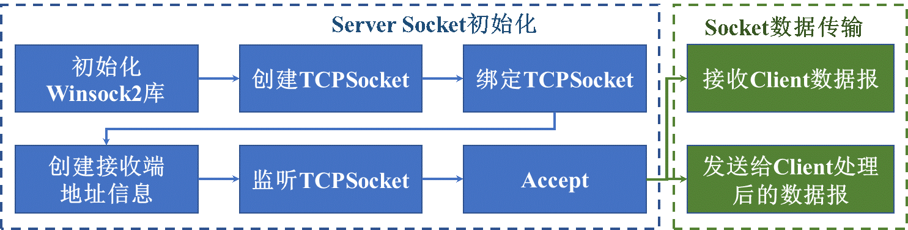
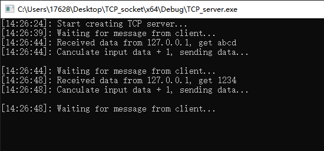
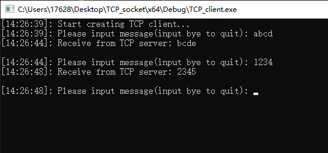

## 基于TCP协议的Echo服务器与客户端开发

### **一、问题描述**

实现基于TCP协议的Echo服务器与客户端开发，server能够将client端发送的数据数值加1后在发回client端。

 

### **二、实现过程**

主体代码全部基于Winsock2库实现，采用Visual Stdio2019进行调试编译。

#### ① Server端

主要调用win32API实现，实现流程图如下：



​    主要实现代码片段：

```c++
    /* 定义结构体变量 */
	WSAData wsaData;

	/* 定义套接字版本，初始化套接字库 */
	if (WSAStartup(MAKEWORD(2, 1), &wsaData) != 0)
	{
		MessageBoxA(NULL, "WinSock startup error", "Error", MB_OK | MB_ICONERROR);
		return 0;
	}
	printf("[%d:%d:%d]: Start creating TCP server...\n", lt->tm_hour, lt->tm_min, lt->tm_sec);

	/* 创建套接字地址类型 */
	SOCKADDR_IN local; 
	SOCKADDR_IN from;

	/* 地址结构体变量的大小 */
	int locallen = sizeof(local);
	int fromlen = sizeof(from);

	/* 设置ipv4，设置ip地址变量端口，ip地址 */
	local.sin_addr.s_addr = inet_addr("127.0.0.1"); //target PC
	local.sin_port = htons(8081); // sever Port
	local.sin_family = AF_INET; //IPv4 Socket

	/* 定义套接字句柄 */
	SOCKET TCP_socket; 

	/* 定义套接字类型 */
	TCP_socket = socket(AF_INET, SOCK_STREAM, NULL);

	/* 绑定对应的地址跟端口号 */
	bind(TCP_socket, (SOCKADDR*)&local, sizeof(local)); 

	/* 开启监听 */
	listen(TCP_socket, SOMAXCONN); 

	/* 开启accept */
	int input_num, output_num;
	SOCKET new_TCP_socket; //build a new socket do new connection. the TCP_socket is just listenning not used to exchange data
	new_TCP_socket = accept(TCP_socket, (SOCKADDR*)&local, &locallen); //newConnection is used to exchange data with client
```

#### ② Client端

主要调用win32API实现，实现流程图如下：


可以发现Client在初始化时与Server基本流程一致，但是不需要绑定监听以及accept Socket环节，只需进行连接并主动向服务器发出请求即可。

Client端与Server端均采用char数组来作为发送接收的缓存，采用sendto以及recvfrom函数进行数据收发。

 

### **三、结果演示**

#### ①Server端



  接收Client端数据，并对接收数组中的每一位字符加1处理后发回Client端。

#### ③ Client端



向Server端发送数据，并接收Server端返回的数据，形成Echo。