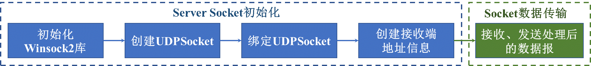
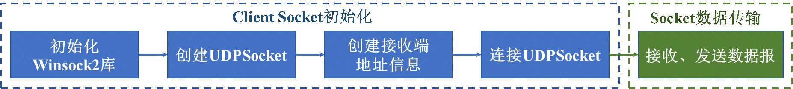
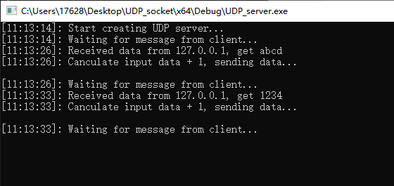
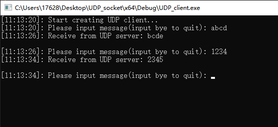

## 基于UDP协议的Echo服务器与客户端开发

### **一、问题描述**

实现基于UDP协议的Echo服务器与客户端开发，server能够将client端发送的数据数值加1后在发回client端。

 

### **二、实现过程**

主体代码全部基于Winsock2库实现，采用Visual Stdio2019进行调试编译。

#### ① Server端

主要调用win32API实现，实现流程图如下：



​    主要实现代码片段：

```c++
	/* 定义结构体变量 */
	WSADATA wsaData;
	int iErrorCode;

	/* 定义套接字版本，初始化套接字库 */
	if (WSAStartup(MAKEWORD(2, 1), &wsaData)) 
	{
		MessageBoxA(NULL, "WinSock startup error", "Error", MB_OK | MB_ICONERROR);
		WSACleanup();
		return;
	}
	
	/* 创建套接字地址类型 */
	SOCKADDR_IN local;
	SOCKADDR_IN from;

	/* 地址结构体变量的大小 */
	int fromlen = sizeof(from);

	/* 设置ipv4，设置ip地址变量端口，ip地址 */
	local.sin_family = AF_INET;//IPv4 Socket
	local.sin_port = htons(8081); // sever Port
	local.sin_addr.s_addr = inet_addr("127.0.0.1"); ///本机
	
	/* 定义套接字句柄 */
	SOCKET UDP_socket;

	/* 定义套接字类型 */
	UDP_socket = socket(AF_INET, SOCK_DGRAM, IPPROTO_UDP);

	/* 绑定对应的地址跟端口号 */
	bind(UDP_socket, (struct sockaddr*) & local, sizeof(local));
```

 

#### ② Client端

主要调用win32API实现，实现流程图如下：



可以发现Client在初始化时与Server基本流程一致，但是不需要绑定Socket环节，因为服务器是实时在监听有没有客户端的连接，所以服务器要绑定IP和端口，而客户端就不需要了，客户端上线是主动向服务器发出请求的。

Client端与Server端均采用char数组来作为发送接收的缓存，采用sendto以及recvfrom函数进行数据收发。

 

### **三、结果演示**

#### ①Server端



  接收Client端数据，并对接收数组中的每一位字符加1处理后发回Client端。

#### ③ Client端



向Server端发送数据，并接收Server端返回的数据，形成Echo。

 